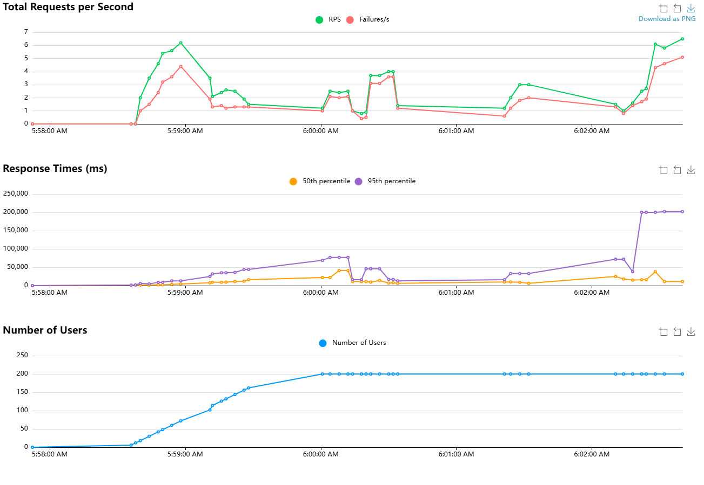

# Pump Anomaly Detection

A machine learning system for detecting anomalies in industrial pump sounds using audio analysis and Random Forest classification. The system includes a FastAPI backend service for predictions and model management, and a Streamlit dashboard for visualization and monitoring.

🚀 **Live Demo**: [https://pumpanomalydetection-thbbg7wkagyvazltlistwj.streamlit.app/](https://pumpanomalydetection-thbbg7wkagyvazltlistwj.streamlit.app/)

📺 **Video Demo**: [Watch on YouTube](https://youtu.be/uvTL3bx2eiA)

## Overview

This project implements an industrial pump anomaly detection system using machine learning and audio analysis. The system processes pump sound recordings to identify abnormal operations that might indicate mechanical issues or failures. It provides both API endpoints for integration and a user-friendly dashboard for monitoring and analysis.

## Dataset

This project uses the **MIMII Dataset: Sound Dataset for Malfunctioning Industrial Machine Investigation and Inspection**. The MIMII dataset contains sound recordings of industrial machines (pumps, fans, valves, and slide rails) under normal and abnormal operating conditions.

- **Dataset Source**: [MIMII Dataset on Zenodo](https://zenodo.org/records/3384388)
- **Machine Type**: Industrial Water Pumps (4 different pump IDs)
- **Recording Conditions**: Normal operation and various fault conditions
- **Audio Format**: WAV files, 10 seconds each, 16 kHz sampling rate

**Note**: The original audio files from the MIMII dataset are not included in this repository due to GitHub's file size limitations. The `data/` folder contains only the preprocessed feature files (`train_features_augmented.csv`, `test_features.csv`) and performance tracking data. To reproduce the full pipeline, download the MIMII dataset from the link above and place the pump audio files in the appropriate directory structure.

## Key Features

- **Audio Analysis**: Process pump sound recordings to detect abnormal operations using advanced signal processing
- **Real-time Predictions**: Upload and analyze audio files through API or dashboard with instant results
- **Interactive Dashboard**: Visualize features, monitor model performance, and manage training with Streamlit UI
- **Cloud Storage**: AWS S3 integration for model versioning, persistence, and data management
- **Production-Ready**: Includes authentication, logging, monitoring, and deployment configuration
- **Model Versioning**: Automatic backup and version control for trained models
- **Feature Engineering**: Comprehensive audio feature extraction including MFCCs, spectral features, and more
- **Data Augmentation**: Training data enhancement for improved model robustness

## Project Structure

```
pump_anomaly_detection/
├── data/
│   ├── test_features.csv           # Preprocessed test features
│   ├── train_features_augmented.csv # Training features with augmentation
│   ├── metrics_history.csv         # Model performance tracking
│   ├── pump/                       # Original audio samples by pump ID
│   │   ├── id_00/
│   │   ├── id_02/
│   │   ├── id_04/
│   │   └── id_06/
│   ├── test/                       # Test audio files
│   │   ├── normal/
│   │   └── abnormal/
│   └── train/                      # Training audio files
│       ├── normal/
│       └── abnormal/
├── models/
│   ├── random_forest_model.pkl     # Current production model
│   ├── random_forest_model_v1_*.pkl # Versioned model backups
│   └── scaler.pkl                  # Feature scaler
├── notebook/
│   └── pump_anomaly_detection.ipynb # Jupyter notebook for analysis
├── src/
│   ├── model.py            # Machine learning model implementation
│   ├── prediction.py       # FastAPI service endpoints
│   ├── preprocessing.py    # Audio feature extraction
│   ├── dashboard.py        # Streamlit dashboard
│   ├── config.py          # Configuration management
│   ├── security.py        # Authentication and authorization
│   ├── storage.py         # Model storage (local/S3)
│   └── logging_config.py   # Logging setup
├── logs/                   # Application logs (created at runtime)
├── .env                    # Environment variables (local development)
├── requirements.txt        # Project dependencies
└── render.yaml            # Render deployment configuration
```

## Technical Stack

- **Backend**: Python 3.13+, FastAPI
- **Frontend**: Streamlit
- **ML Framework**: scikit-learn (Random Forest)
- **Audio Processing**: librosa, NumPy, SciPy
- **Visualization**: Plotly, Matplotlib, Seaborn
- **Storage**: AWS S3, local file system
- **Deployment**: Render (production), uvicorn (development)
- **Authentication**: API Key, JWT tokens
- **API Communication**: Requests with dynamic timeouts and exponential backoff retry logic
- **Fault Tolerance**: Smart request handling with endpoint-specific timeouts
- **Configuration**: Environment variables, pydantic
- **Logging**: Python logging with rotating file handlers

## Audio Feature Analysis

The system analyzes several audio features to detect pump anomalies:

1. **Mel-Frequency Cepstral Coefficients (MFCCs)**
   - 13 MFCC coefficients (mean, std, max, min for each)
   - Captures sound timbre and spectral characteristics
   - Helps identify irregular vibrations and mechanical faults

2. **Spectral Features**
   - **Spectral Centroid**: Indicates average frequency content (brightness)
   - **Spectral Bandwidth**: Shows frequency distribution spread
   - **Spectral Roll-off**: Measures frequency energy distribution

3. **Time-Domain Features**
   - **RMS Energy**: Measures sound intensity and power
   - **Zero Crossing Rate**: Analyzes signal complexity and pitch
   - Statistical measures (mean, std, max, min) for all features

4. **Data Augmentation**
   - Noise addition, time stretching, pitch shifting
   - Increases training data diversity and model robustness
   - Helps handle real-world recording variations

## Dataset Information

The project utilizes audio recordings from 4 different industrial water pumps (IDs: 00, 02, 04, 06) from the MIMII dataset. Each pump has recordings under:

- **Normal Operation**: Baseline sound patterns during proper functioning
- **Abnormal Operation**: Various fault conditions including bearing defects, impeller issues, and other mechanical problems

The preprocessing pipeline extracts 73 features from each 10-second audio recording, creating a comprehensive feature set for machine learning classification. Due to GitHub's file size limitations, only the processed feature files are included in this repository.


## Model Evaluation Metrics
- Accuracy
- Precision
- Recall
- F1-Score
- Confusion Matrix

## API Endpoints

### `/predict/`
- **Method**: POST
- **Purpose**: Make predictions on new audio files
- **Input**: .wav audio file (multipart/form-data)
- **Output**: Prediction (normal/abnormal) with confidence score
- **Authentication**: API Key required
- **Processing Time**: 30-120 seconds depending on audio file size and complexity
- **Timeout**: 120 seconds with automatic retry logic

### `/retrain/`
- **Method**: POST
- **Purpose**: Retrain model with new data
- **Input**: Multiple .wav files with labels (normal and abnormal samples)
- **Output**: Training results, model performance metrics, and new model version
- **Authentication**: API Key required
- **Processing Time**: 1-5 minutes depending on dataset size
- **Timeout**: 300 seconds (5 minutes) with automatic retry logic

### `/evaluate/`
- **Method**: GET
- **Purpose**: Get current model performance metrics
- **Output**: Classification report, confusion matrix, and metrics history
- **Authentication**: API Key required
- **Processing Time**: 10-60 seconds depending on test dataset size
- **Timeout**: 60 seconds with retry logic

### `/model-info/`
- **Method**: GET
- **Purpose**: Get information about the current model
- **Output**: Model type, path, version, and training status
- **Authentication**: API Key required

### `/health/`
- **Method**: GET
- **Purpose**: Health check endpoint
- **Output**: Service status and uptime
- **Authentication**: None required

## Dashboard Sections

1. **Model Monitoring**
   - Model uptime and status tracking
   - Performance metrics history with time-series plots
   - Latest evaluation metrics and trends
   - Feature analysis visualizations and correlations
   - Model version information and metadata

2. **Predictions**
   - Audio file upload interface
   - Waveform and spectrogram visualization
   - Real-time prediction results with confidence scores
   - Feature analysis for uploaded audio
   - Prediction history tracking

3. **Training**
   - Separate upload for normal and abnormal samples
   - Training progress tracking and status
   - Model version history and comparison
   - Training metrics visualization
   - Model backup and restoration options

## Setup and Deployment

### Local Development

1. Clone the repository:
   ```bash
   git clone https://github.com/akumuyi/pump_anomaly_detection.git
   cd pump_anomaly_detection
   ```

2. Install dependencies:
   ```bash
   pip install -r requirements.txt
   ```

3. Set up environment variables (.env file for local development):
   ```bash
   # Create .env file in project root
   ENVIRONMENT=development
   API_KEY=your_secure_api_key_here
   SECRET_KEY=your_jwt_secret_key_here
   AWS_ACCESS_KEY_ID=your_aws_access_key
   AWS_SECRET_ACCESS_KEY=your_aws_secret_key
   S3_BUCKET=your_s3_bucket_name
   STORAGE_TYPE=s3  # or 'local' for local storage
   LOG_LEVEL=INFO
   ```

4. Run the services:
   ```bash
   # Start FastAPI server (backend)
   uvicorn src.prediction:app --reload --host 0.0.0.0 --port 8000

   # Start Streamlit dashboard (frontend) - in a new terminal
   streamlit run src/dashboard.py --server.port 8501
   ```

5. Access the services:
   - API Documentation: http://localhost:8000/docs
   - Streamlit Dashboard: http://localhost:8501

### Production Deployment (Render)

1. Push code to GitHub

2. Connect repository to Render:
   - Create a new Blueprint
   - Select your repository
   - Render will automatically detect `render.yaml`

3. Set environment variables in Render dashboard:
   ```
   ENVIRONMENT=production
   PYTHON_VERSION=3.13.5
   API_KEY=your_secure_api_key
   SECRET_KEY=your_jwt_secret_key
   AWS_ACCESS_KEY_ID=your_aws_access_key
   AWS_SECRET_ACCESS_KEY=your_aws_secret_key
   S3_BUCKET=your_s3_bucket_name
   STORAGE_TYPE=s3
   LOG_LEVEL=INFO
   ```

4. The deployment includes two services:
   - **API Service**: FastAPI backend on port 8000
   - **Dashboard Service**: Streamlit frontend on port 8501

5. **Live Production Deployment**: 
   - Dashboard: [https://pumpanomalydetection-thbbg7wkagyvazltlistwj.streamlit.app/](https://pumpanomalydetection-thbbg7wkagyvazltlistwj.streamlit.app/)
   - API Documentation: Available through the dashboard interface

## Security & Authentication

- **API Key Authentication**: All API endpoints require valid API key in X-API-Key header
- **JWT Token Support**: Token-based authentication for extended sessions
- **Secure Credential Management**: Environment-based configuration with no hardcoded secrets
- **Request Validation**: Input validation and sanitization for all endpoints
- **CORS Configuration**: Proper cross-origin resource sharing setup for production

## Monitoring and Logging

- **Rotating File Logs**: Automatic log rotation with size limits (10MB per file, 5 backups)
- **Separate Loggers**: Dedicated loggers for API, model, and dashboard components
- **Performance Metrics Tracking**: Historical tracking of model performance stored in CSV
- **Model Version Control**: Automatic versioning and backup of trained models
- **Health Monitoring**: Service health checks and uptime tracking
- **Error Tracking**: Comprehensive error logging with stack traces


## Load Testing Results

I performed load testing on the Pump Anomaly Detection API using Locust to simulate user traffic and assess performance under stress.

**Test Configuration:**
- **API Host:** `https://pump-anomaly-api.onrender.com`
- **API Key:** Configured
- **Test Data Paths:**
   - Normal audio: `data/test/normal`
   - Abnormal audio: `data/test/abnormal`

### Summary of Results

- **High Failure Rates:** Out of 644 requests, 458 failed (71% failure rate). Several endpoints had a 100% failure rate.
- **Slow Response Times:** Median response time was 8,300 ms; 95th percentile reached 81,000 ms; maximum exceeded 200 seconds.
- **Endpoint Performance:**
   - **Health Check (GET):** 12.3% failure rate, median response 8,300 ms, 95th percentile 163,000 ms.
   - **Model Evaluation (GET), Model Info (GET), Predict normal (POST), Prediction (normal) (POST):** 100% failure rate under load.

### Detailed Metrics

| Type | Endpoint | # Requests | # Fails | Median (ms) | 95%ile (ms) | 99%ile (ms) | Avg (ms) | Min (ms) | Max (ms) | Avg Size (bytes) | RPS | Failures/s |
|------|----------|------------|---------|-------------|-------------|-------------|----------|----------|----------|------------------|-----|------------|
| GET  | Health Check | 212 | 26 | 8,300 | 163,000 | 200,000 | 21,256 | 832 | 201,700 | 103.53 | 2.1 | 0.7 |
| GET  | Model Evaluation | 106 | 106 | 7,700 | 200,000 | 202,000 | 29,537 | 0 | 201,851 | 19.55 | 1.6 | 1.6 |
| GET  | Model Info | 112 | 112 | 5,300 | 42,000 | 199,000 | 16,772 | 0 | 200,435 | 24.5 | 1.4 | 1.4 |
| POST | Predict normal | 76 | 76 | 25,000 | 72,000 | 82,000 | 28,847 | 4,551 | 82,068 | 53.07 | 0.3 | 0.3 |
| POST | Prediction (normal) | 138 | 138 | 6,900 | 66,000 | 81,000 | 15,922 | 0 | 82,279 | 29.22 | 1.1 | 1.1 |
| **Aggregated** | | 644 | 458 | 8,300 | 81,000 | 201,000 | 21,592 | 0 | 201,851 | 54.08 | 6.5 | 5.1 |

### Visual Analysis

#### Visualistion


- **Requests per Second:** RPS peaked at 6/s, failures at 4/s, with instability at peak loads.
- **Response Times:** 95th percentile spiked to 200,000 ms, indicating severe latency.
- **User Count:** Stabilized at ~200 users, correlating with performance degradation.

### Key Insights

- **Scalability Issues:** API cannot handle 200 concurrent users; high failure and latency.
- **Critical Endpoint Failures:** "Model Evaluation," "Model Info," "Predict normal," and "Prediction (normal)" endpoints failed 100% under load.
- **Health Check Limitations:** Some success, but high response times persist.

### Recommendations

- **Diagnose Failures:** Investigate root causes for endpoint failures (server overload, resource limits, bugs).
- **Reduce Latency:** Optimize backend logic, database queries, and server resources.
- **Enhance Scalability:** Consider horizontal/vertical scaling.
- **Iterative Testing:** Continue load testing with varied user counts to determine capacity and guide improvements.


## Future Improvements

1. **Real-time Features**
   - Live audio streaming analysis
   - WebSocket connections for real-time updates
   - Continuous monitoring dashboard

2. **Enhanced ML Capabilities**
   - Deep learning models (CNN, RNN)
   - Ensemble methods and model stacking
   - Automated hyperparameter tuning

3. **Advanced Analytics**
   - Anomaly severity scoring
   - Predictive maintenance scheduling
   - Historical trend analysis

4. **System Enhancements**
   - Automated model retraining triggers
   - A/B testing for model versions
   - Extended API functionality
   - Mobile application interface

## Contributing

1. Fork the repository
2. Create your feature branch
3. Commit your changes
4. Push to the branch
5. Create a new Pull Request

## License

This project is licensed under the MIT License - see the LICENSE file for details.

## Authors

- **Abiodun Kumuyi** - *Initial work* - [akumuyi](https://github.com/akumuyi)
